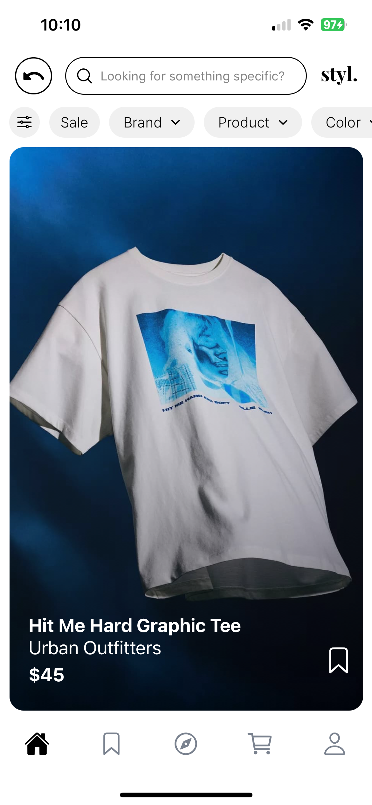
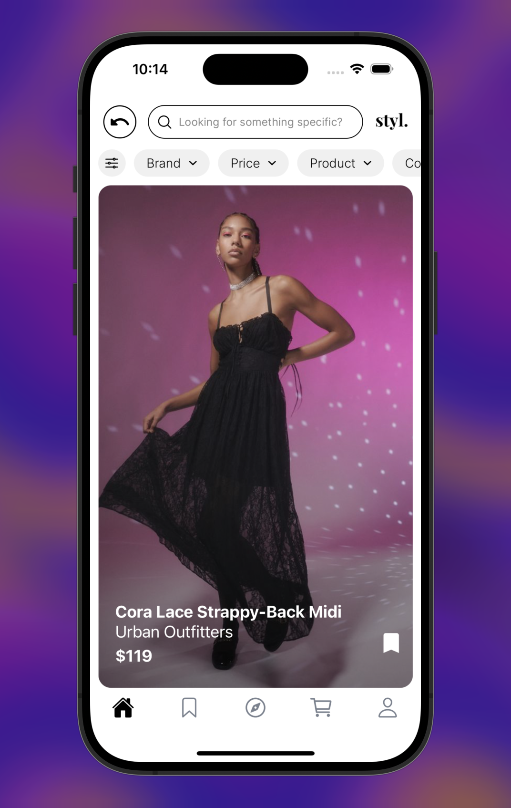

<h2>My Projects</h2>

  <!-- Project 1 -->
  

    
    

      <h3>Fashion Ecommerce App</h3>
      
Development &bull; 16 May 2024

      
I built a fashion e-commerce application using TS React Native, Python FastAPI, and MongoDB, focusing on seamless user experience and modern design principles.

    

    <a href="https://github.com/rahulbhandari18/project1" class="btn">View on GitHub</a>
  

  
  <!-- Project 2 -->
  

    
    

      <h3>Creating a Responsive Grid</h3>
      
Product Design &bull; 12 May 2024

      
This project showcases a responsive grid design using CSS Grid and Flexbox for flexible layouts across devices.

    

    <a href="https://github.com/rahulbhandari18/project2" class="btn">View on GitHub</a>
  

  
  <!-- Add more projects here -->

